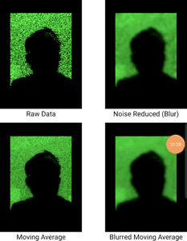

# Time of Flight Camera Example 

This is an example app that demonstrates how to capture and process data from a Time of Flight camera, specifically the front-facing "3D Camera" on the Samsung S10 5G.

## How to Use
Clone and run on an Samsung S10 5G device from Android studio (3.5.1 at the time of publishing).

There is also an associated post [here](https://medium.com/@lukesma/working-with-the-3d-camera-on-the-samsung-s10-5g-4782336783c).
